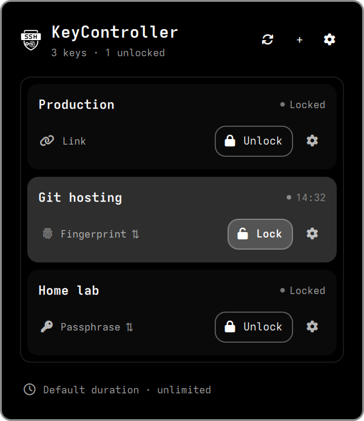
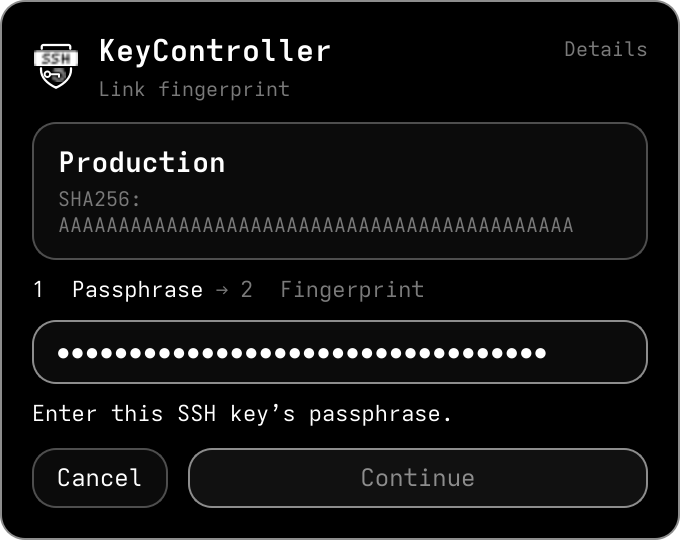
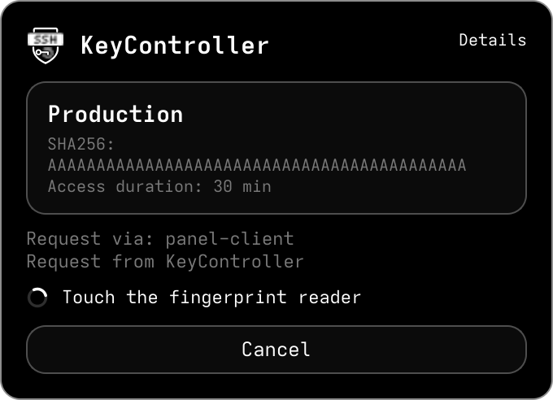
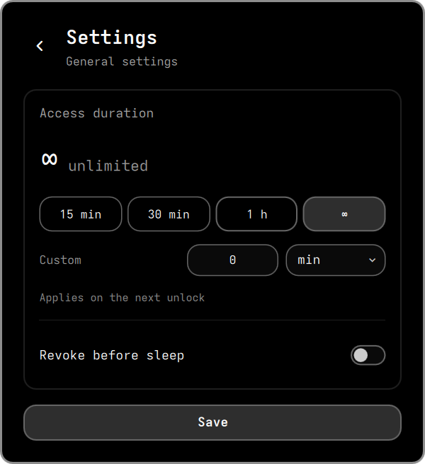
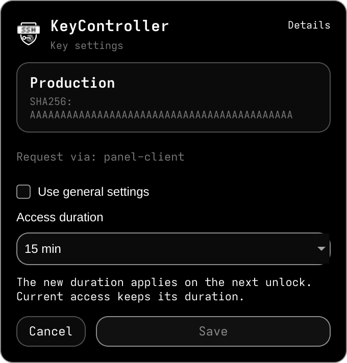
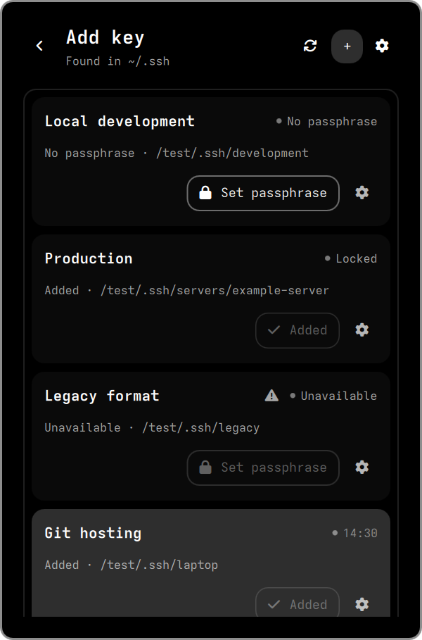

# KeyController

**SSH key access, right from your Omarchy bar.**

Unlock with a passphrase or fingerprint, choose how long a key stays available, and close access with a click.

<p align="center">
  
</p>

<p align="center"><sub>Real interface, demonstration keys. Colors and typography follow your Omarchy theme.</sub></p>

## Unlock your way

Use the key's passphrase, or **link it to your enrolled fingerprint**. Each key remembers its preferred method. Switch between them directly in the widget; switching alone never opens the key.

Unlocking opens a compact authentication window. Fingerprint scanning starts automatically, and progress stays visible while the key opens. The window shows who requested access and, when provided, why. **Lock** closes access immediately, without another confirmation window.

<table>
  <tr>
    <th>Link a fingerprint</th>
    <th>Unlock with a touch</th>
  </tr>
  <tr>
    <td align="center" valign="top"></td>
    <td align="center" valign="top"></td>
  </tr>
</table>

Linking checks your key's passphrase and fingerprint, then leaves the key locked. Future fingerprint unlocks still require a fresh scan.

## Decide how long access lasts

Set a shared duration, give individual keys their own timer, or leave access unlimited. Timers continue working when the widget is closed. New durations apply on the next unlock.

Enable **Revoke before sleep** to close all managed key access before the computer sleeps. After waking, those keys stay locked until you open them again. This option starts off; screen locking alone does not revoke keys.

<table>
  <tr>
    <th>Shared defaults</th>
    <th>Per-key control</th>
  </tr>
  <tr>
    <td align="center" valign="top"></td>
    <td align="center" valign="top"></td>
  </tr>
</table>

## Keep the keys you already use

KeyController finds existing keys in `~/.ssh`, including subfolders. It supports **Ed25519, RSA and ECDSA in OpenSSH format**. The first scan is automatic; refresh whenever you add or move a key.

The **+** button lets you add a passphrase to an unencrypted key. Its public identity stays the same, so your servers' `authorized_keys` need no changes. Existing encrypted keys can be added without changing their passphrase.

<details>
<summary>See the key discovery view</summary>

<p align="center"></p>

</details>

## Let your tools ask for access

**AI agents, applications and your own scripts** can request a key through **`kctrl`**. You see who requested access and why in the same authentication window; the calling tool receives the result without receiving your passphrase. A key that is already open is reused without extending its timer.

For example, add an unlock request to a deployment script before its SSH step:

```sh
kctrl keys unlock --key '<key-id>' --interactive --reason 'Deploy application' --json
```

The script waits for your fingerprint or passphrase in your unlocked local desktop session, then continues only when the key is unlocked. The command returns immediately: if the result is `pending`, the script must track the returned request ID with `kctrl requests status` until `unlocked`, and stop on cancellation, denial, expiry or error. [CLI and request states](docs/api.md)

Instructions for **Codex, Claude Code and OpenCode** are included and connected during setup when those clients are present. [Agent workflow](skills/keycontroller/SKILL.md)

## Fits your desktop

- **Theme-aware:** icons, colors and fonts follow Omarchy.
- **English and Russian:** selected automatically from the system language.
- **Standard SSH tools:** works through the original OpenSSH agent for SSH and Git.
- **Your existing lockscreen:** its appearance and authentication stay under its own control.

Closing a key does not disconnect an established SSH session. While a key is open, other processes of your user can use its agent access. [Security model and limitations](docs/security.md)

<details>
<summary><strong>Installation, requirements and removal</strong></summary>

Install the widget with Omarchy's plugin manager:

```sh
omarchy plugin add https://github.com/Wolfengo/KeyController.git --enable
```

Requires Omarchy with Quickshell, OpenSSH and the separate **KeyController system package**. The widget checks dependencies and guides setup. Until the helper is available in your signed package repositories, it needs a [separate package installation](docs/setup.md#installation). Fingerprint use additionally requires TPM2, fprintd and an enrolled fingerprint; passphrase mode works without biometric hardware. [Full requirements and setup](docs/setup.md#installation)

To remove the widget:

```sh
omarchy plugin remove org.omarchy.keycontroller
```

This keeps the helper and your keys. To also disconnect the managed agent and remove the system package, follow [complete removal](docs/setup.md#removal).

</details>

## License

Code: [MIT](LICENSE). The adapted Google Material Icons fingerprint is [Apache-2.0](plugin/icons/THIRD_PARTY_NOTICES.md).
